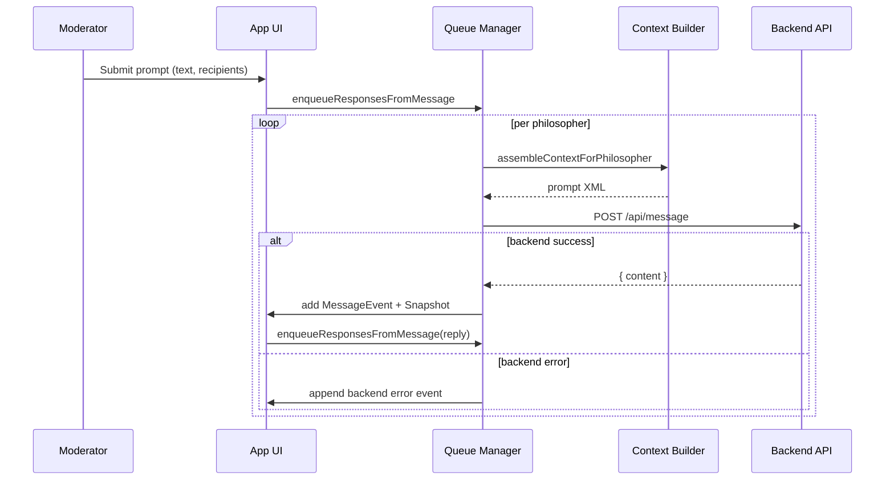

# Confucian Café Dialogue Orchestrator – Architecture Overview

This document explains how the Vite/React front end is structured, how it coordinates multi-philosopher dialogues, and how it communicates with the NabokovsWeb backend at `http://localhost:3100`.

## 1. High-Level Topology

```mermaid
flowchart LR
    subgraph Moderator
        UI[Moderator UI]
    end
    subgraph Frontend[Frontend (Vite + React)]
        App[App.tsx]
        Memory[lib/memory.ts]
        Context[lib/context.ts]
        API[lib/api.ts]
        Data[data/mockData.ts]
    end
    subgraph Backend[NabokovsWeb Backend]
        APIService[/POST /api/message\nGET /health/]
    end

    UI -->|prompts, toggles| App
    App -->|seed data| Data
    App <-->|in-memory conversation state| Memory
    App -->|assembled prompt payload| Context
    Context --> App
    App -->|fetch| API
    API --> APIService
    APIService -->|JSON response| API
    API --> App
    App -->|updates| UI
```

- **App.tsx** centralizes UI composition, state management, and queue orchestration.
- **lib/memory.ts** stores message history per recipient and exposes helpers used during prompt assembly.
- **lib/context.ts** renders the XML-style prompt sent to the backend for a specific philosopher turn.
- **lib/api.ts** wraps `fetch` calls to `/api/message` and `/health`.
- **data/mockData.ts** seeds philosopher personas, canned messages, and snapshot examples for offline demos.

## 2. Major React State Domains

| State Domain | Purpose | Defined In |
|--------------|---------|------------|
| `philosophers`, `activeIds` | Determines which personas are active and eligible to receive prompts. | `App.tsx` lines 106-144 |
| `languageDefaults`, `showInsights` | Controls transcript augmentation (Modern/Classical Chinese toggles and reasoning display). | `App.tsx` lines 115-119, 604-734 |
| `messages`, `snapshots`, `eventFeed` | Drives transcript rendering, inspector content, and status ticker. | `App.tsx` lines 119-389 |
| `queuesRef`, `processingRef`, `processedMessagesRef` | Track queued response tasks, in-flight processing, and deduplication for auto-replies. | `App.tsx` lines 174-188, 254-315 |
| `memories` | Memoizes conversation history for prompt context reuse. | `App.tsx` line 134, `lib/memory.ts` |

## 3. Dialogue Lifecycle

1. **Moderator composes a prompt.** The `PromptComposer` component calls `handlePrompt`, storing a `MessageEvent`, pushing it to memory, and enqueueing response tasks for each targeted philosopher.
2. **Queue management.** Each philosopher maintains a FIFO queue of `ResponseTask`s (`queuesRef`). `drainQueues` triggers `runQueue` per philosopher when auto-responses are not paused.
3. **Context assembly.** Before contacting the backend, `processTask` calls `assembleContextForPhilosopher`, embedding persona instructions, truncated memory, the latest exchange, and the new directive into an XML payload.
4. **Backend call.** `sendMessageToBackend` POSTs `{ messages: [{ role: 'user', content: promptText }] }`. If the backend is offline, an event-feed warning is appended.
5. **Response parsing.** `parseModelResponse` extracts `reasoning` and `finalText` from raw backend text or JSON. The resulting `MessageEvent` is added to history, `memories`, and inspector snapshots.
6. **Propagation.** The new message triggers `enqueueResponsesFromMessage`, enabling other philosophers to reply, and updates the UI (transcript, event feed, queue counters).

The following sequence diagram highlights the key call chain:



## 4. Inspector & Memory Model

- **Memory store** (`MemoryState`) keeps per-recipient log slices and an `all` bucket. Each entry records `id`, `timestamp`, `speaker`, `recipients`, `message`, and `phase`.
- **Inspector snapshots** capture the rendered prompt plus the subset of conversation history relevant to the philosopher who just responded. Snapshots are stored in chronological order and surfaced via the inspector drawer.

## 5. Styling & Layout

- `styles/app.css` defines a two-column layout: roster/controls sidebar and the main dialogue board. Components use utility classes like `.pill`, `.card`, `.event-feed`, and `.prompt-composer`.
- Visual themes reference traditional Chinese color palettes (red/gold) and a paper texture background.

## 6. External Interfaces

- **/api/message** – Expects JSON from the backend with a `content` field containing the model’s reply. Errors are surfaced in the event feed; the UI continues operating using mock data.
- **/health** – Provides a boolean to toggle backend status indicator in the header.

## 7. Local Development Workflow

- `npm run dev` starts the Vite dev server with proxy rules defined in `vite.config.ts`.
- `npm run build` runs TypeScript diagnostics first (`tsc`) and then generates production assets.
- `npm run preview` serves the built bundle locally.

## 8. Extensibility Notes

- The queue architecture is modular: `ResponseTask`s are generic, allowing future scheduling policies (e.g., single-speaker mode, prioritization).
- `createEmptyMemories` accepts a `max` parameter, making it straightforward to adjust history window sizes or introduce per-philosopher limits.
- Persona templates live in `data/mockData.ts`; new philosophers can be injected via the “Add participant” form exposed in the controls tab.

This document should serve as the canonical reference for how the current system operates and where to extend it.
